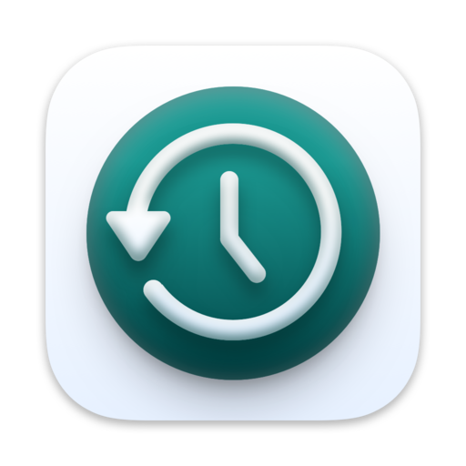

  

  <h1 align="center">
  Time Machine
</h1>

 简单地备份你的 Windows

  

> [!NOTE]
> 您可以以三种方式打开Time-Machine
> 1. 下载 `Time-Machine-Setup.exe` ，运行安装。
> 2. 下载 `Time-Machine-Windows.zip` ，解压后打开其中的 `Time-Machine.exe`
> 3. 下载软件源代码压缩包 `Source code (zip)` ，解压后在所在目录下运行 `python Time-Machine.py`
>    （使用步骤二前请先安装 Python ， 运行 `winget install python` 即可）

## 功能与计划

- [x] 备份
- [x] ……

## 致谢以下存储库或项目
- [PyQt5](https://www.riverbankcomputing.com/static/Docs/PyQt5/)
- [PyQt Fluent Widgets](https://github.com/zhiyiYo/PyQt-Fluent-Widgets)

## 星标历史

 <picture>
   <source media="(prefers-color-scheme: dark)" srcset="https://api.star-history.com/svg?repos=Detritalw/Time-Machine&type=Date&theme=dark" />
   <source media="(prefers-color-scheme: light)" srcset="https://api.star-history.com/svg?repos=Detritalw/Time-Machine&type=Date" />
   
 </picture>

## 相关链接
[Bloret QQ 群](https://qm.qq.com/q/clE5KHaVDG)
